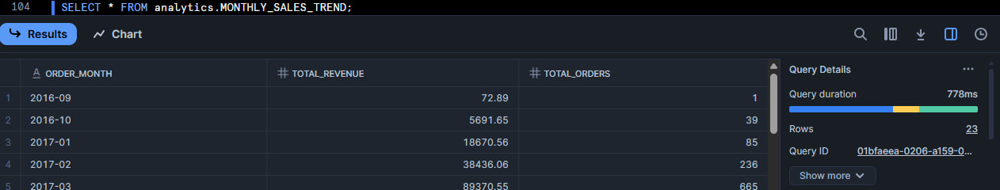

#  Snowflake_Ecommerce_Analytics

## 📌 Project Overview:
- End-to-end data analytics pipeline built entirely in Snowflake, transforming raw e-commerce data into business-ready insights using SQL.
- The project demonstrates layered architecture, data quality validation, advanced SQL analytics, and query optimization techniques (CTEs, window functions, clustering).
- 📊 Dataset Source: [Click here to view on Kaggle](https://www.kaggle.com/datasets/olistbr/brazilian-ecommerce?resource=download&select=olist_products_dataset.csv)

### 🧰 Tech Stack:

- Snowflake – Cloud data warehouse for storage, transformation, and analytics
- SQL – Data modeling, transformations, and advanced analytics
- Stored Procedures & Views – Automated table refresh and complex query management
- Data Quality Checks – Ensuring data consistency and integrity

### 📸 Snapshots:
Here’s a snapshot of the data table from the project:

### 🔄 Pipeline Overview:
1️⃣ Raw Layer – Data Ingestion:
- Load CSV files into Snowflake using the COPY INTO command.
- Create base raw tables for:
  1.customers_raw
  2.orders_raw
  3.order_items_raw
  4.payments_raw
  5.products
  6.sellers
- Schema: ecommerce.raw

2️⃣ Processed Layer – Data Cleaning & Transformation
- Clean and standardize data:
  1.Trim spaces, correct data types, fix nulls.
  2.Add validation flags (order_flag, item_flag, payment_flag).
  3.Remove duplicates and inconsistent entries.
- Schema: ecommerce.processed
- Cleaned Tables:
   - customers_clean
   - orders_clean
   - order_items_clean
   - payments_clean
   - products_clean
   - sellers_clean

3️⃣ Analytics Layer – Business Aggregations
- Generate key aggregated insights for decision-making
  
|           🧩  Insight            |                     📄 Description                   |
|-----------------------------------|------------------------------------------------------|
|     `Top 10 Cities by Revenue`    |     Cities contributing the most to total revenue    |
|     `Preferred Payment Types`     |     Most used and highest-value payment methods      |
|     `Top 10 Selling Categories`   |     Product categories with highest total sales      |
|     `Top 10 Sellers`              |     Sellers generating the highest sales             |
|     `Monthly Sales Trend`         |     Month-wise revenue and order volume trend        |

- Schema: ecommerce.analytics

4️⃣ Advanced Analytics Layer – Deep Insights
- Implements advanced SQL topics such as:
  - CTEs for modular query optimization
  - Window functions (RANK(), SUM() OVER()) for ranking and cumulative metrics
  - Views for reusable analytical logic
  - Stored Procedures for automated refresh of top-performing tables
  - Optimization techniques:
       - Query-level: Filter pushdown with CTEs
       - Table-level: Clustering by frequently used columns (order_month)
  - Schema: ecommerce.advanced_analytics
  - Examples:
      - vw_customer_order_summary
      - vw_top_customers_per_city
      - sp_refresh_top_sellers

### ⚙️ Optimizations Implemented

|       Type      |                    📄 Description                                              |                            Example                                 |
|-----------------|--------------------------------------------------------------------------------|---------------------------------------------------------------------|
|  `Query-Level`  |  Pushed filters early using CTEs to reduce scanned data                        | vw_customer_order_summary_optimized                                 |
|  `Table-Level`  |  Clustered tables on high-frequency filter columns to improve scan performance | ALTER TABLE analytics.monthly_sales_trend CLUSTER BY (order_month); |

- ✅ Result: Faster query execution and reduced Snowflake compute cost.

### 📊 Business Insights Generated
- 📈 Monthly growth in sales and revenue
- 🏙️ Highest revenue-contributing cities
- 💳 Customer payment behavior and preferences
- 👥 Top customers per city (window functions)
- 📦 Top sellers by performance and revenue share

## 📂 Project Structure: 
- `README.md` → Complete project documentation
- `1_SQL_Raw.sql` → Create and load raw tables
- `2_SQL_Cleaning_and_Processing.sql` → Data cleaning and flagging
- `3_SQL_Analytics.sql` → Business-level aggregated tables
- `4_SQL_Quality_Check.sql` → Data quality validation
- `5_SQL_Advanced_Analytics.sql` → Advanced analytics (CTEs, window, optimization)
- `images/` → Screenshot (snowflake_table_overview)
  
